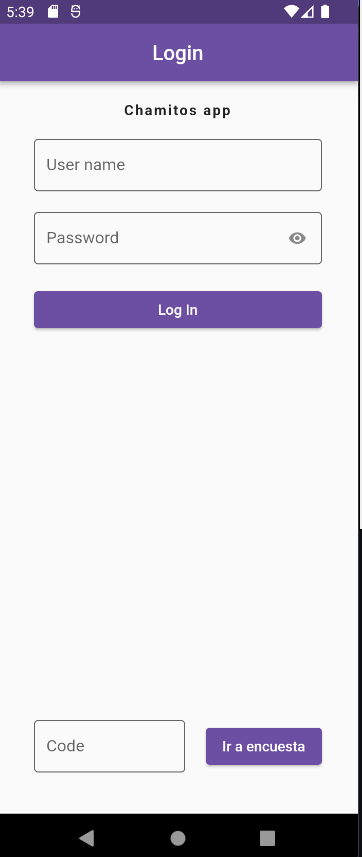
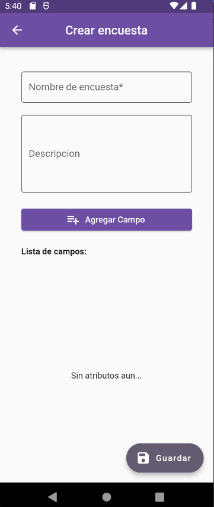
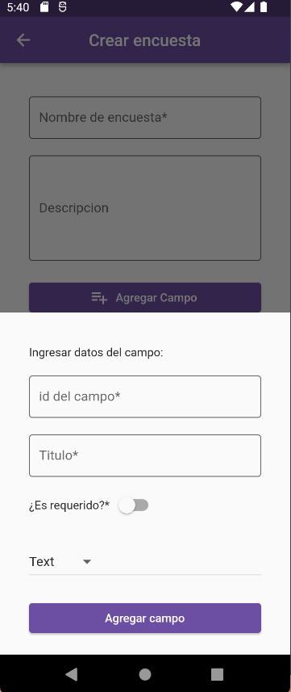
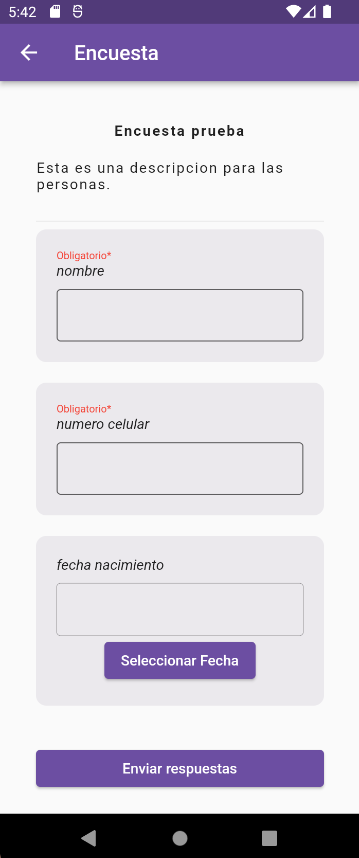

# Chamitos

Es una aplicacion movil donde se pueden:

- Crear encuestas
- Revisar respuesta de encuestas
- Eliminar encuesta
- Responder encuesta

<p align="center">
  
  
  
  

## Getting Started

```
flutter pub get
```

## Librerias usadas

```
firebase_database: ^10.2.5
firebase_core: ^2.15.1
firebase_auth: ^4.8.0
```

## Estructura de datos

Firebase storage :

```
encuestas{
    campos[
        {
            nombre,
            requerido,
            tipo,
            titulo
        }, ...
    ]
    descripcion,
    nombre,
    resultados[
        {
            respuesta1,
            respuesta2,
            respuesta3
        }
    ]
}
```

## Reglas

- Para ingresar un encusta es necesio ingresar al menos un campo
- El login no tiene restriccion por el momento
- Es necesario poseer conexion a internet para hacer las consultas
- El codigo de la encuesta es el nombre de la ecuesta, tener cuidado con los espacios en blanco
